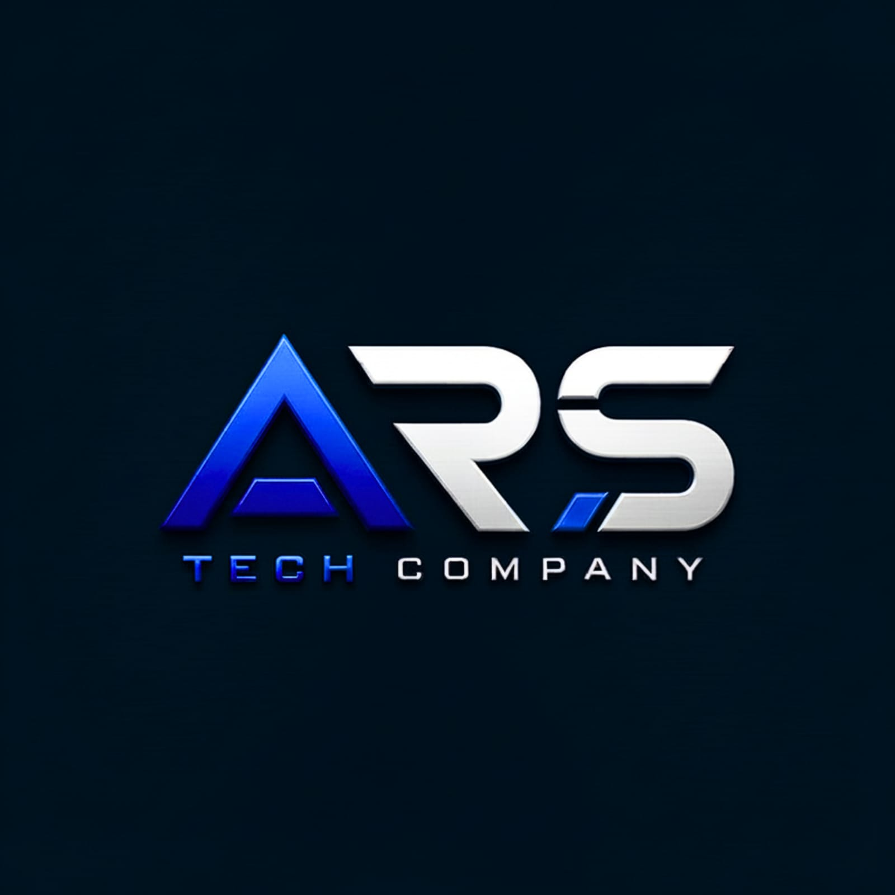

<a name="top"></a>

<div align="center">
  

  <h1>ARS GEEK — Blog Geek da ARS Tech Company</h1>

  <p><em>"Onde tecnologia encontra cultura pop."</em></p>

  <p>
    
    
    
    
  </p>
</div>

---

## Sobre

Blog editorial geek da ARS Tech Company, publicado em `geek.arstechcompany.com.br`. Cobre seis categorias —
Filmes, Star Wars, Marvel, DC, Animes e Games — com busca local e filtro por categoria. Identidade dark-mode
derivada do site institucional (`arstechcompany-site`), com uma camada "HUD sci-fi" e ciano elétrico
(`#38bdf8`) como cor de assinatura do braço geek.

O conteúdo editorial vive em `lib/posts.ts`: **18 matérias originais** (3 por categoria), assinadas por
Renato Brito e publicadas em 13/07/2026, escritas com base em fatos verificados em fontes públicas
(Wikipedia, Deadline, Variety, Box Office Mojo, StarWars.com, Marvel.com, ILM.com e imprensa
especializada). O corpo dos artigos usa uma estrutura de blocos tipados (`ArticleBlock`: parágrafo,
subtítulo, citação, destaque, código) pensada para migração futura a CMS headless, API ou MDX sem
alterações nos componentes.

> Newsletter, formulário de inscrição e qualquer envio de e-mail **não fazem parte deste escopo** — ficaram
> de fora intencionalmente.

## Stack

- [Next.js](https://nextjs.org) 16 (App Router) + [React](https://react.dev) 19 + TypeScript 5
- CSS puro com variáveis de design tokens (`app/globals.css`) — mesma abordagem do `arstechcompany-site`
- `output: "export"` — build 100% estático, sem servidor Node em produção
- Fontes Geist / Geist Mono via `next/font/google`

## Estrutura

```text
arstechcompany-geek/
├── app/
│   ├── layout.tsx              # metadata raiz, fontes, GA/AdSense condicionais
│   ├── page.tsx                # Home
│   ├── artigos/page.tsx        # Listagem (busca + filtro + paginação)
│   ├── artigos/[slug]/page.tsx # Artigo (SSG via generateStaticParams)
│   ├── componentes/page.tsx    # Design system (interno; fora do menu, noindex)
│   ├── not-found.tsx           # 404
│   ├── sitemap.ts / robots.ts  # SEO
│   └── globals.css             # Design tokens + estilos
├── components/                 # Header, Footer, PostCard, CoverPlaceholder,
│                                # CategoryBadge, ArticleBody, ArticlesExplorer
├── lib/                        # posts.ts, categories.ts, types.ts, site.ts,
│                                # colors.ts, format.ts — dados mockados + helpers
├── public/
│   ├── CNAME                    # geek.arstechcompany.com.br
│   └── images/                  # logo e imagens locais
├── CNAME                        # geek.arstechcompany.com.br
└── .github/workflows/
    ├── ci.yml                   # esteira: lint + build em PRs e branches
    └── deploy.yml               # lint + build + deploy no GitHub Pages (main)
```

## Como executar localmente

```bash
npm install
npm run dev
```

Acesse [http://localhost:3000](http://localhost:3000).

```bash
npm run build   # gera o export estático em out/
npm run lint    # ESLint (next/core-web-vitals + typescript)
```

## Variáveis de ambiente

Nenhuma é obrigatória para rodar localmente. Copie `.env.example` para `.env.local` se quiser ativar
Analytics/AdSense em dev:

| Variável | Uso | Obrigatória |
|---|---|---|
| `NEXT_PUBLIC_SITE_URL` | URL canônica usada em metadata, `sitemap.xml` e `robots.txt` | Não (default `https://geek.arstechcompany.com.br`) |
| `NEXT_PUBLIC_GA_MEASUREMENT_ID` | ID do Google Analytics (gtag). Script só é injetado se definida | Não |
| `NEXT_PUBLIC_ADSENSE_CLIENT_ID` | Client ID do Google AdSense. Script só é injetado se definida | Não |

Essas duas últimas não são segredos — são os mesmos identificadores públicos já usados no
`arstechcompany-site` (`G-84NNFCLZVT` e `ca-pub-9829402470557693`), reaproveitados aqui. Ficam fora do
código-fonte para manter o padrão de configuração via ambiente e para permitir desativar cada integração
individualmente sem editar código.

## Esteira (CI/CD)

Dois workflows no GitHub Actions:

- **`ci.yml`** — roda em pull requests para `main` e em pushes de qualquer outra branch: instala
  dependências, executa `npm run lint`, `npm run build` e valida que o export estático gerou as páginas
  esperadas (`index.html`, `artigos.html`, `sitemap.xml`, `robots.txt`).
- **`deploy.yml`** — roda em push na `main`: lint → build → publica `out/` no GitHub Pages. O lint é
  etapa obrigatória; se falhar, o deploy não acontece.

O deploy é configurado para o domínio customizado `geek.arstechcompany.com.br`, servido na raiz. Por isso,
o build não usa `basePath` nem `assetPrefix`: CSS, JS, imagens e fontes devem sair como `/_next/static/...`,
`/images/...` e demais caminhos absolutos a partir da raiz do domínio.

## Deploy no GitHub Pages

O workflow `.github/workflows/deploy.yml` builda e publica a pasta `out/` a cada push em `main`.

1. Em **Settings → Secrets and variables → Actions → Variables**, defina (opcional, para ativar
   Analytics/AdSense em produção):
   - `NEXT_PUBLIC_GA_MEASUREMENT_ID`
   - `NEXT_PUBLIC_ADSENSE_CLIENT_ID`
2. Em **Settings → Pages**, configure a fonte como "GitHub Actions".
3. Configure o DNS de `geek.arstechcompany.com.br` (registro `CNAME` apontando para
   `<usuario>.github.io`) — `public/CNAME` já contém o domínio e é copiado automaticamente para `out/`
   pelo export estático do Next.js.
4. Faça push para `main` — o Actions builda (`next build` com `output: "export"`) e publica `out/` via
   `actions/deploy-pages`.

Deploy manual (sem Actions), se necessário:

```bash
npm run build
cp CNAME out/CNAME
touch out/.nojekyll
# publique o conteúdo de out/ no branch/host de sua escolha
```

## Limitações conhecidas

- O conteúdo (18 matérias) vive em `lib/posts.ts` como TypeScript tipado; não há CMS, API ou build de
  MDX conectado ainda — a estrutura de blocos foi desenhada para essa migração.
- As capas dos artigos são fotos reais do Wikimedia Commons (CC0/CC BY/CC BY-SA/domínio público),
  otimizadas em WebP e servidas localmente — créditos completos em `IMAGE_CREDITS.md`. O placeholder
  HUD original permanece como fallback automático caso alguma imagem falhe (`components/ArticleImage.tsx`).
- Busca e filtro de categoria são client-side sobre o array em memória; não escalam para um catálogo
  grande sem paginação no servidor/API.
- Fatos das matérias foram verificados em julho/2026; artigos sobre lançamentos futuros (GTA VI,
  Doomsday, The Batman: Parte II) refletem o estado das informações nessa data.
- Newsletter/inscrição por e-mail foram propositalmente omitidas deste escopo.
